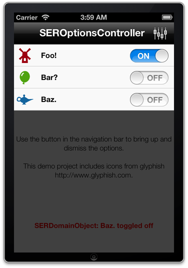

# SEROptionsController

A simple component that shows a list of options to switch on and off.

## Usage

    SEROptionsController *optionsController = [SEROptionsController new];
    
    optionsController.values = @[
      [SERDomainObject objectOfType:kTypeFoo],
      [SERDomainObject objectOfType:kTypeBar],
      [SERDomainObject objectOfType:kTypeBaz],
    ];

    optionsController.selectedValues = @[
      [SERDomainObject objectOfType:kTypeFoo],
      [SERDomainObject objectOfType:kTypeBaz],
    ];
    
    // block to transform input values into strings to be displayed in the table cells
    optionsController.stringTransformationBlock = ^(SERDomainObject *object) {
      return [SERDomainObject stringForType:object.type];
    };

    // optional block to transform input values into image icons to be displayed in the table cells
    optionsController.imageTransformationBlock = ^(SERDomainObject *object) {
      return [SERDomainObject imageForType:object.type];
    };
    
    // optional block to configure table cells
    optionsController.cellConfigurationBlock = ^(UITableViewCell *cell, NSIndexPath *indexPath)
    {
      cell.textLabel.font            = [UIFont fontWithName:@"HelveticaNeue-Bold" size:15.];
      cell.textLabel.backgroundColor = [UIColor clearColor];
      
      // setting cell.accessoryView with a custom switch (must respond to `-on` and `-setOn:`)
      // cell.accessoryView = [[TTSwitch alloc] initWithFrame:CGRectMake(0.0, 0.0, 76.0, 27.0)];
    };

    // optional: customize table view appearance a bit
    [optionsController view]; // make sure view is loaded
    optionsController.tableView.separatorStyle  = UITableViewCellSeparatorStyleNone;
    optionsController.tableView.backgroundColor = [UIColor clearColor];
    optionsController.tableView.scrollEnabled   = NO;

    // present the thing
    [optionsController presentInView:self.view selectionChanged:^(SERDomainObject *object, BOOL on) {
      // ... do something as a result of the value being changed
    }];
    
    // eventually dismiss
    [optionsController dismiss];

## Notes

Compatibility: iOS 5.0

See the LICENSE file.

(c) 2013 Stanley Rost